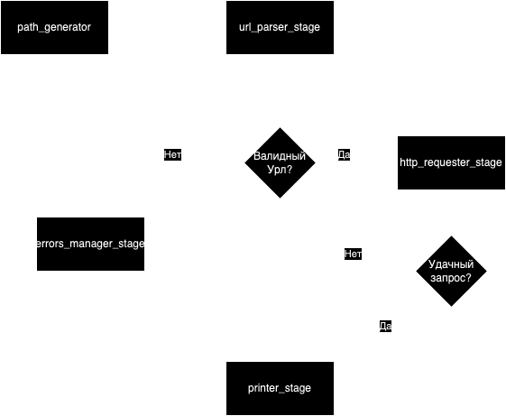

# odo_my_office

Тестовое задание Go для компании "Мой офис"

### Запуск проекта:
1. Сборка проекта: `go build .`
2. Запуск проекта: `./odo_my_office --path {path}`

Вместо {path} передать путь до файла: относительный или абсолютный

Если путь валидный и сервер ответил, то формат вывода следующий: url: {url}, response_size: {size}, time_processing: {time}

### Реализация задания основана на паттерне пайплайн.
1. Общая реализация пайплайна и воркер-пула представлены в пакете worker.
2. В пакете state реализация некого состояния объекта, выполняющего действия.
3. В пакете main представлены стадии пайплайна:
   1. path_generator - Генератор, который считывает урлы из файла и пишет их в канал
   2. url_parser_stage - Стадия, которая проверяет валидность считанных урлов и пишет результат в канал
   3. http_requester_stage - Стадия, которая выполняет http-запросы по валидным урлам и пишет результат в канал
   4. errors_manager_stage - Стадия, реализованная на основе паттерна fan-in, которая перенаправляет ошибки из разных каналов в один
   5. printer_stage - Стадия, которая печатает результат работы в поток вывода

